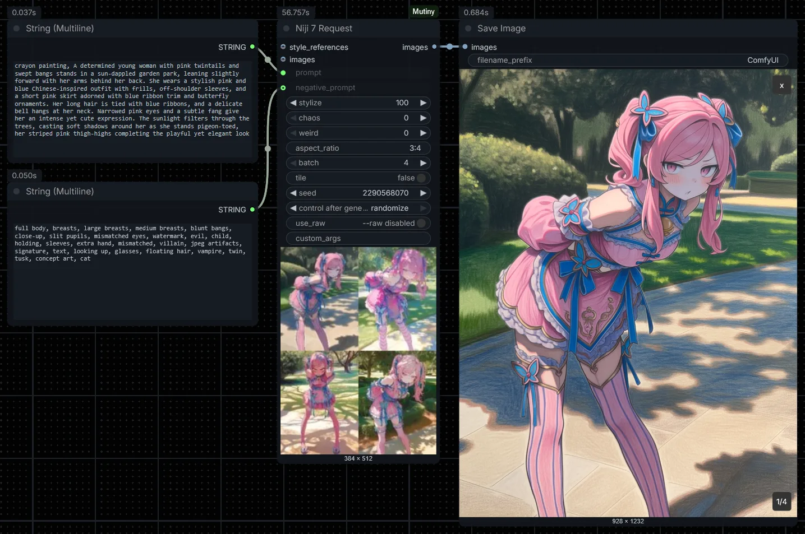

# ComfyUI-Mutiny

[](LICENSE) [](https://registry.comfy.org/publishers/artificialsweetener/nodes/mutiny) [](https://registry.comfy.org/publishers/artificialsweetener/nodes/mutiny) [](https://www.python.org/downloads/)

**English** | [简体中文](README.zh-CN.md)

This is **ComfyUI-Mutiny**, the unofficial Midjourney integration for ComfyUI.

Are you a creator with a workflow split between Discord and ComfyUI? Are you constantly dragging assets around between your Midjourney chat window or the MJ website, into your Comfy graph, and then back out again? You're a rare breed, but I've seen you in the wild and I know you're wasting a lot of time and effort on this ping-pong game.

Mutiny is here to bring all of the powerful features your Midjourney subscription pays for into Comfy as special nodes that let you thread your workflow between the cloud and your local machine. Prompt an image into existence with a Midjourney or Niji request node, enhance it with a diffusion upscale or SAM-backed inpainting routine, send it back out to MJ to animate!



## Features

 - Integrates Midjourney into your ComfyUI workflow with a set of custom nodes. MJ concepts have been mapped fully to ComfyUI conventions
 - Supports every MJ on Discord feature as of March 2026 including Vary by Region and Animate
 - Progress updates and live previews fully supported so that our nodes feel like native ksampler nodes
 - Remembers which of your images came directly from Midjourney. This means you can come back to them later and Mutiny knows which MJ actions are valid for that image (or video)
 - Easy to reason about node controls that are contextual to each version of MJ; see a full range of MJ commands available per model without having to remember them all
 - Full image prompting support: Prompt with images just by connecting them to different image inputs on the relevant nodes
 - Responsible security posture: stores your Discord token in your OS' secure credential vault on the machine running ComfyUI. Mutiny will never attached your token to your workflows or print it to your ComfyUI console logs

## Installation

**Recommended: install through ComfyUI Manager**

Open **🧩 Manager** from the ComfyUI toolbar, click **Custom Nodes Manager**, search for **Mutiny**, and click **Install**. Restart ComfyUI after installation.

**Manual install**

If you'd rather install it yourself, clone this repo into `ComfyUI/custom_nodes/`, activate your **ComfyUI venv**, and install this node's requirements. ComfyUI already provides most of the shared runtime dependencies. This plugin additionally requires `mutiny-sdk` and `keyring`.

```powershell
cd ComfyUI\custom_nodes
git clone https://github.com/Artificial-Sweetener/ComfyUI-Mutiny.git
cd ComfyUI-Mutiny
pip install -r requirements.txt
```

## Important Disclaimer

Mutiny interacts with Discord and Midjourney in ways that could be interpreted as violating their Terms of Service. **We make no guarantees about safety.** Use of Mutiny could result in action against your Discord account, your Midjourney account, or both, including warnings, restrictions, or bans.

That said, Mutiny is designed to behave politely and conservatively. It is not intended to spam, hammer endpoints, evade limits, or behave abusively. We do not expect most legitimate users to have issues, but we cannot promise that. You are responsible for judging the risks for yourself before using it.

Mutiny requires your **Discord token** to function. That is sensitive account access material. Handling it is inherently risky, and if it is exposed or mishandled, someone else could gain access to your Discord account. Mutiny takes reasonable precautions by storing the token in your operating system's secure credential storage, but no storage approach is risk-free and you remain responsible for protecting your account.

Mutiny also requires a **paid Midjourney account**. It is not a way to get free Midjourney access. It is not designed to bypass Midjourney's moderation systems, payment requirements, rate limits, or other platform restrictions. It is not intended for running multiple accounts or automating activity across multiple accounts. Mutiny is meant for legitimate use by a single user operating their own account.

## First-Time Setup

Mutiny needs a little configuration before it can set sail.

Open ComfyUI Settings and look for the **Mutiny** section. From there, configure:

- **Guild ID**: The Discord server Mutiny should use.
- **Channel ID**: The Discord channel Mutiny should submit jobs through.
- **Discord Token**: The private account credential Discord uses to identify   
  and authenticate your logged-in session. **This is effecitvely your username and password rolled into one**. Mutiny saves the supplied token into your operating system's secure credential storage.
> This project does **not** provide instructions for obtaining your Discord token, and you should read the disclaimer above before deciding whether to use one with Mutiny.
- **API Endpoint**: Optional advanced override. You can probably leave this alone.
- **Artifact Cache RAM** and **Artifact Disk**: Control how much context Mutiny keeps around for recognizing earlier Midjourney outputs.
- **Task Timeout Minutes**: Controls how long ComfyUI waits before a running job times out.

The cache matters more than it might sound at first glance. Mutiny uses cached recognition data to understand when an image or video came from a prior Midjourney job, which is what enables follow-up actions like **Upscale**, **Variation**, **Pan**, **Zoom**, and **Extend** to behave like proper continuations instead of blind guesses.

## The Nodes

This pack is built to cover the whole Midjourney trip, from first prompt to later action.

### Prompt Captains

Request nodes are the nodes you use to submit a Midjourney or Niji job from prompt text.

Mutiny has dedicated request nodes for **Midjourney v4, v5, v6, and v7**, and for **Niji 4, 5, 6, and 7**. Each of those nodes is built around the actual rules of that version, so the controls match what that version really supports. You are not looking at one generic prompt form with a version dropdown slapped on top. The available inputs change with the model.

That matters because these versions do not all support the same aspect-ratio rules, quality controls, style controls, reference-image features, or other prompt arguments. The version-specific request nodes take those differences into account so you only see the controls that make sense for the version you picked.

Most of these request nodes also include a **custom args** input. That gives you a direct escape hatch for supported Midjourney arguments that Mutiny does not surface as first-class controls.

Mutiny also includes:

- **Midjourney v8 Alpha Request** as a more limited node for the current v8 alpha surface
- **Midjourney Custom Request** as the fallback node when you want to type a version string yourself, build a request more manually, or use features that Midjourney supports before Mutiny has caught up with dedicated controls for them

If you want the short version: the request nodes exist so you do not have to memorize which Midjourney or Niji version supports which arguments, while still leaving you room to drop down to **custom args** or **Custom Request** when you need more control.

### Reference Keepers

These nodes wrap images with Midjourney-specific meaning so your request nodes can stay clean and your graphs stay readable.

- **Midjourney Image Prompt**: Attach one image as a prompt image, with optional image-weight control.
- **Midjourney Style Reference**: Attach style-reference images, optional style weight, optional style version, and optional per-image multipliers.
- **Midjourney Character Reference**: Attach one or more character-reference images with optional character weight.
- **Midjourney Omni Reference**: Attach a single Omni reference image with optional Omni weight.
> Tip!: Want to prompt with more than one image? That's supported where Midjourney itself supporst it, but you need to turn your images into a batched set first. Many nodes exist that can do this, take your pick!

These are the glue nodes. They don't make the picture alone, but they let the rest of the graph speak Midjourney properly.

### Follow-Up Actions

This is where Mutiny starts feeling especially nice inside ComfyUI.

These nodes operate on **recognized Midjourney outputs**, using Mutiny's cache and job context so the right follow-up action can be submitted against the right source.

- **Midjourney Upscale**: Run Standard, Subtle, or Creative upscale modes from a recognized Midjourney result.
- **Midjourney Variation**: Submit Standard, Subtle, or Strong variation actions from a recognized Midjourney grid tile.
- **Midjourney Pan**: Continue a recognized Midjourney image outward in one direction.
- **Midjourney Zoom**: Submit a recognized Midjourney image to Zoom with a precise factor and optional prompt text.
- **Midjourney Vary Region**: Edit a masked area of a recognized Midjourney image with a fresh prompt.

This part is important: these are not generic image filters. If you hand them an image Mutiny cannot recognize as part of its cached Midjourney history, they will fail clearly instead of pretending.

### Signals and Motion

Midjourney is more than one kind of output, and these nodes round out the pack.

- **Midjourney Describe**: Send any image to Midjourney Describe and get prompt text back.
- **Midjourney Animate**: Turn a start frame into a native ComfyUI `VIDEO`, with optional end frame, prompt, negative prompt, and batch controls.
- **Midjourney Extend**: Take a recognized Midjourney video and continue it with the motion level you choose.

Together, these nodes let you move between image prompting, prompt recovery, and short-form video workflows without leaving the graph.

## A Note on Recognition

Mutiny keeps track of Midjourney jobs so later actions can stay attached to the real source context. That means some nodes care deeply about provenance.

- **Request** and **Describe** nodes can start from fresh input.
- **Upscale**, **Variation**, **Pan**, **Zoom**, and **Extend** depend on Mutiny recognizing the incoming image or video from its cache.
- **Vary Region** uses a recognized Midjourney source image plus a mask so the edit can be submitted through the proper Midjourney path.

If you think of those action nodes as "continue this Midjourney thing I already made," you'll understand them exactly right.

## License

**ComfyUI-Mutiny** is licensed under the GNU Affero General Public License v3.0 (**AGPL-3.0**). Please read the full [LICENSE](LICENSE) included with this repo.

The AGPL-3.0 is a strong copyleft license. If you convey the software, you must provide its corresponding source; and if you let users interact with a modified version over a network, you must offer them that modified version's corresponding source.

## From the Developer 💖

I'm gonna let you in on a little secret... I don't even really use Midjourney! I built these nodes because I have a lot of awesome friends who do, and I just knew they'd get some use out of something like this. Besides, the challenge seemed interesting. 

I waded through a ton of different options but ultimately I landed on rolling [my own Python library](https://github.com/Artificial-Sweetener/Mutiny-SDK) and then building these nodes around it. If I hadn't done that, this would be a lot clunkier than it is.

That said, because I'm not really a regular MJ user, and it's not free, supporting this project is going to come down to if I can afford to keep doing it. Mutiny is inherently brittle by its very nature and therefore is very likely to break and need maintenance in the future.

If this project helps you and you can afford to do so, consider tossing me a tip on [Ko-Fi](https://ko-fi.com/artificial_sweetener), or becoming a patron [on Patreon](https://www.patreon.com/ArtificialSweetener).

If you can't do that but still want to help, I'd love to see your support on social media. You can find my links on [my website](https://artificialsweetener.ai). I'd also love it if you gave this project a star here on GitHub.

Thank you!
