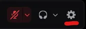
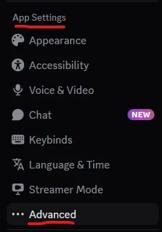
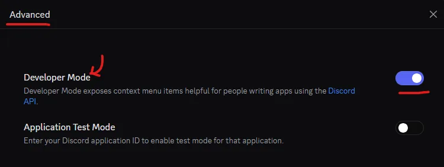
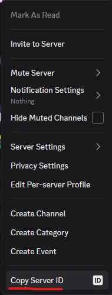
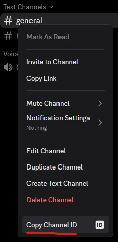

# Discord Developer Mode、Guild ID 和 Channel ID

Mutiny 需要两个 Discord 标识符：

- **Guild ID**：你使用 Midjourney 机器人的 Discord 服务器 ID
- **Channel ID**：Mutiny 应该在该服务器内使用的频道 ID

换句话说，你需要选择 **Midjourney 机器人确实对你可用、并且被允许运行** 的那个服务器和频道。

要复制这些 ID，首先需要在 Discord 中启用 **Developer Mode**。

## 1. 打开 Developer Mode

在 Discord 中，点击左下角附近的齿轮图标，打开 **User Settings**。

然后进入：

- **Advanced**
- 打开 **Developer Mode**

## 2. 复制 Guild ID

进入你希望 Mutiny 使用的 Discord 服务器。

右键点击服务器图标或服务器名称，然后点击 **Copy Server ID**。

复制得到的值就是你的 **Guild ID**。

## 3. 复制 Channel ID

打开该服务器中你希望 Mutiny 使用的频道。

右键点击频道名称，然后点击 **Copy Channel ID**。

复制得到的值就是你的 **Channel ID**。

## Notes

- Guild ID 和 Channel ID 可以安全地复制到 Mutiny 的设置中。
- 你的 **Discord token** 不同。它属于敏感的账户访问资料，必须更加谨慎地处理。
- 如果你决定使用 Mutiny，你需要自行了解如何获取自己的 Discord token。不要向维护者请求相关说明或支持。
- 本指南只涵盖 Developer Mode、Guild ID 和 Channel ID。
